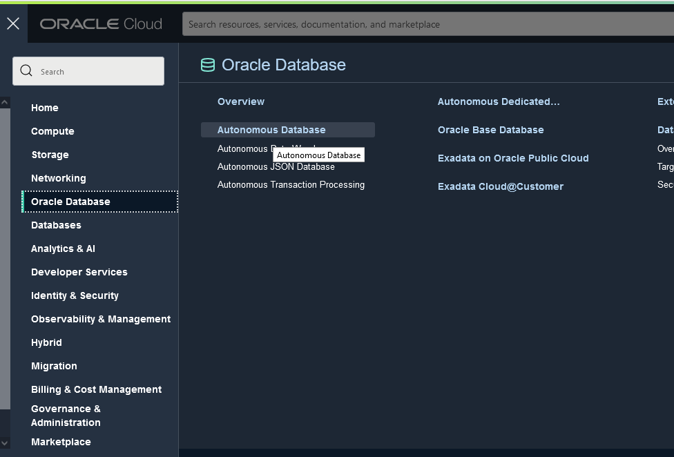
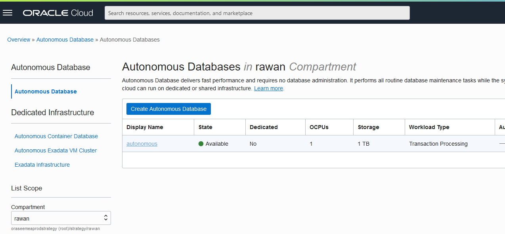
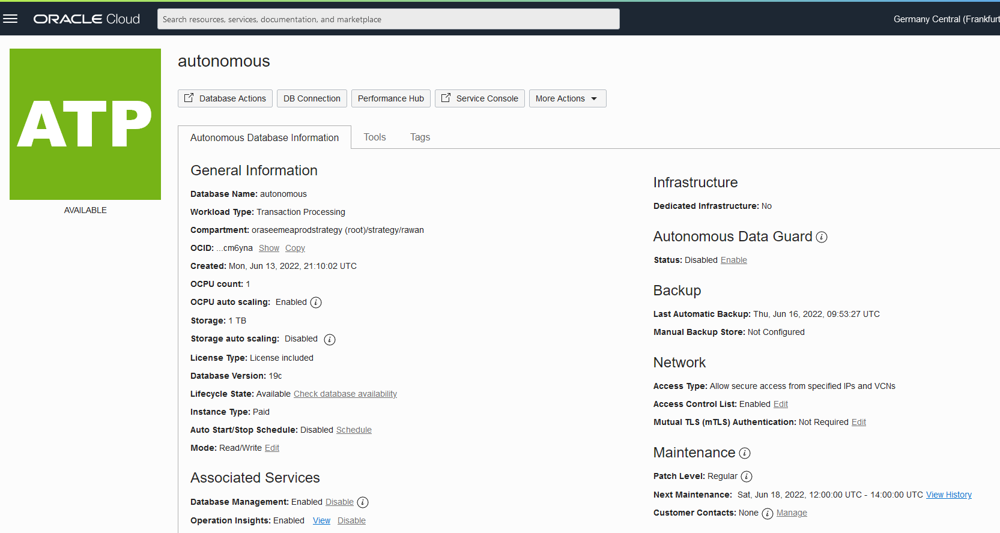
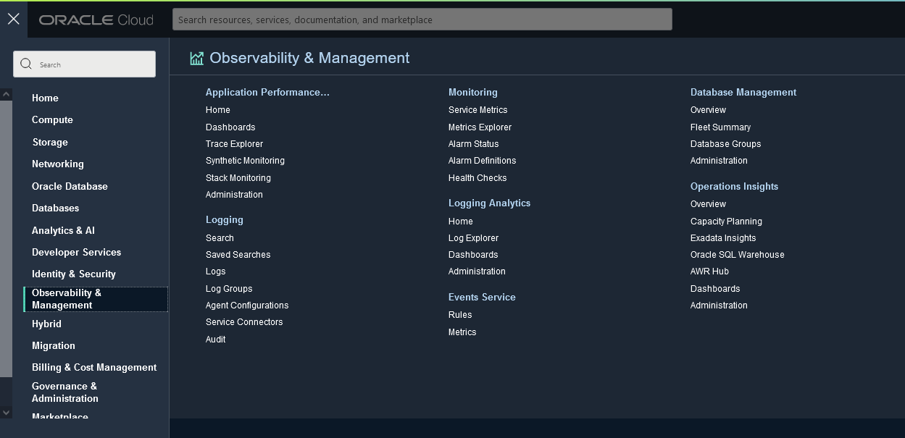
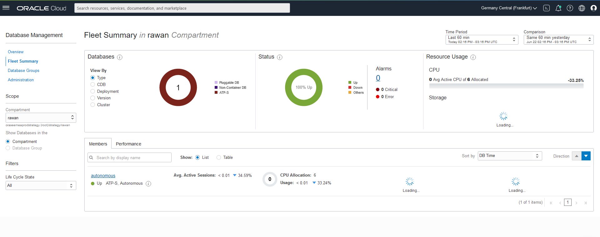
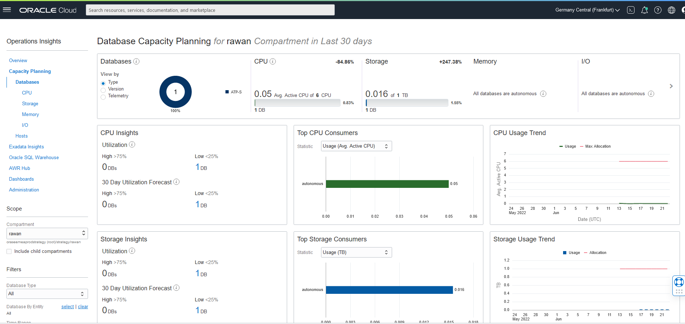

# Database Management & Operation Insights

## Introduction

In this lab we will unleash the capabilites of  and review aggregated data in a dashboard and explore the available logs in the Log Explorer. 

Estimated Time: X minutes

### Objectives

In this lab, you will:
- explore the Fleet Summary.


## Task 1: Enable DataBase Management & Operation Insights
- Go to the Menu select Oracle Database > Autonomous DataBase
  

- As you can see the Database instance has been created with the terraform apply job, click on the DB instance,
  

- At the Associated Features click Enable for both Database Management & Operations Insights



## Task 2: View the Fleet Summary and Capacity Palnning 
- From the Menu go back to the Observability & Management > Database Management


- You can see on the Fleet summary diffrent information related to the the Database instance

 
- You can see further information related tou planning capacity from the realted features > Operations Insights
  
  
 
## Task 3: Simulate an outage

- Back on the cloud shell, connect to the OKE CLuster 


- Deploy the load simulation pods
```
<copy>
kubectl create -f https://raw.githubusercontent.com/oracle-quickstart/oci-cloudnative/master/src/load/load-dep.yaml
</copy>
```
### Logging Analytics
- go to the created dashboard on Logging Analytics and observe the changes happening on the OKE cluster


### Monitoring
- if


 

