# Infrastructure Configuration

## Introduction

In this lab we will build the infrastructure that we will use to run the rest of the workshop.  The sample application is a showcase of several Oracle Cloud Infrastructure services in a unified reference application. It implements an e-commerce platform built as a set of micro-services. The accompanying content can be used to get started with cloud native application development on Oracle Cloud Infrastructure.

The repository contains the application code as well as the Terraform code, that creates all the required resources and configures the application on the created resources.

Estimated Time: X minutes

### Objectives

In this lab, you will:
-	Deploy the Oracle Cloud Infrastructure Container Engine for Kubernetes(OKE).


### Prerequisites

- Log-in to your OCI tenancy.
  

## Task 1: Enable access to Log Group with Instance Principal

  - First you need to enable Logging analytics service, go to the menu and select **Observability and Management** and select **Logging Analytics**

  

  - Then click  **Start Using Logging Analytics**

  

  - Once done, click **Take Me To Log Explorer**

  

 - Now go back to the menu on the left top side and choose **_Identity & Security_**, then **_Dynamic Groups_**

  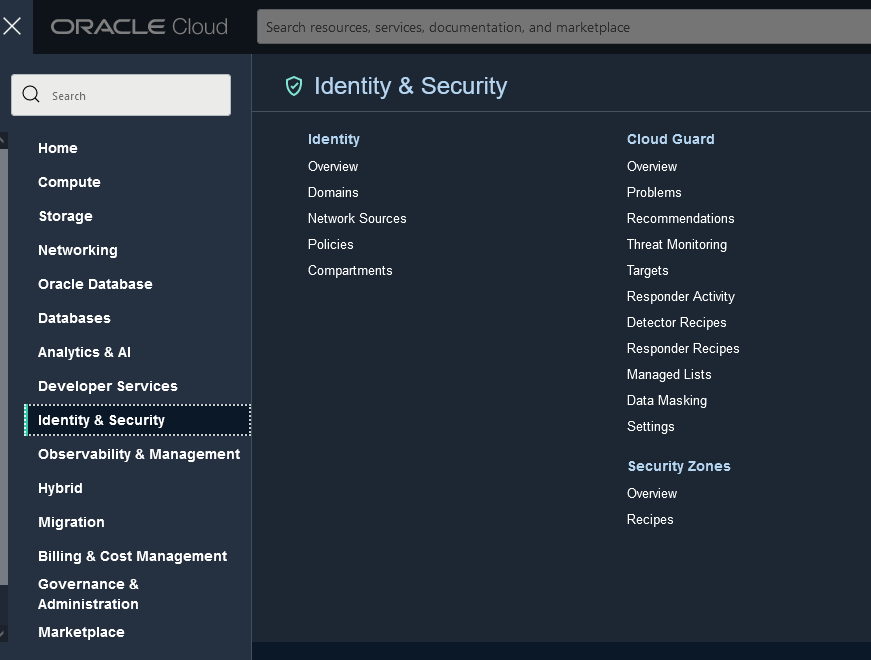

 - Create a Dynamic Group called **_dynamic-group-oke-node-pool_** that matches OKE node pool workers with matching rule:
    ```
    <copy>All {instance.compartment = '<COMPARTMENT_NAME>'}</copy>
    ```  
   You have to replace **`COMPARTMENT_NAME`** for the compartment name where your Kubernetes Cluster is going to be created.
 
 - From the left side menu select **_Policies_**, and create a policy to allow access to Log Group with the following rule:
  
  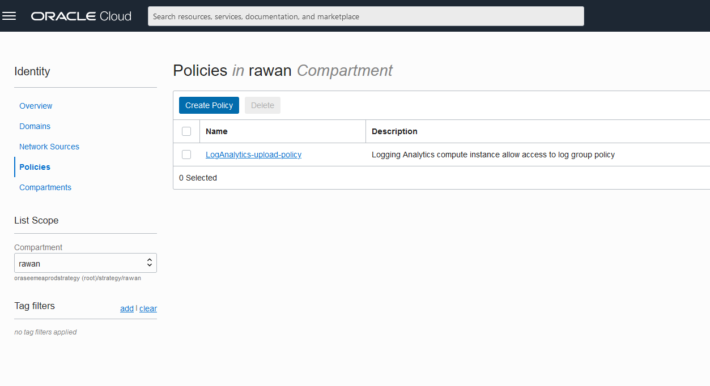
  
    ```
    <copy>
    Allow dynamic-group dynamic-group-oke-node-pool to {LOG_ANALYTICS_LOG_GROUP_UPLOAD_LOGS} in compartment <COMPARTMENT_NAME>  
    </copy>
    ```
  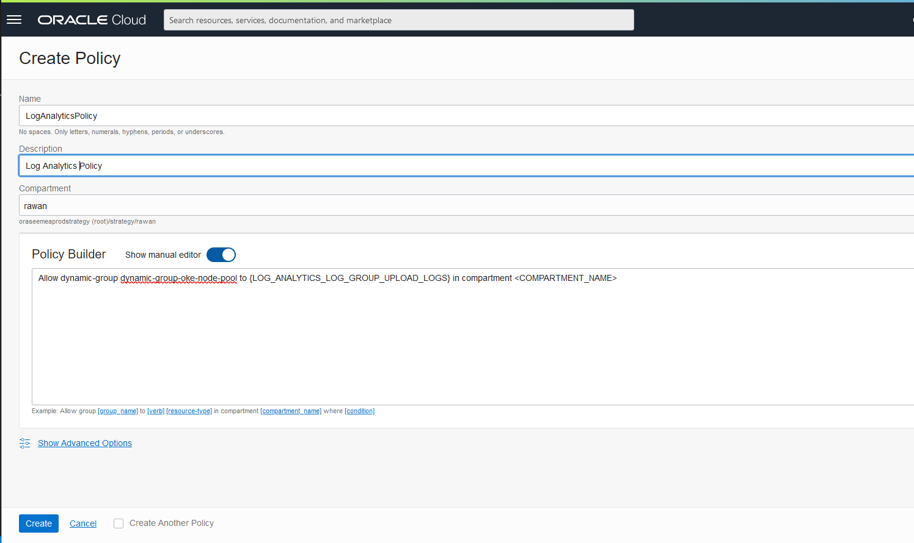
## Task 2: Create a Log Source in the Logging Analytics
 
   A **_log source_** is the built-in definition of where log files are located and how to collect, mask, parse, extract and enrich the collected log data.

 - From the top left menu choose **_Observability & Management > Logging Analytics > Administration_**

  

 - On the side menu, click **_Sources_**.

 - Click **_Create Source_** and fill the form with the following information:
   
    ```
      Name: <copy>hello-api-source</copy>
    ```
    ```
      Description: <copy>Hello API App Source</copy>
    ```
    ```
      Source Type: <copy>File</copy>
    ```
    ```
      Entity Types: <copy>OCI Compute Instance</copy>
    ```
    ```
      Parser: <copy>Automatically parse time only</copy>
    ```
 
 - Click **_Create Source_** to confirm.

## Task 3: Deploy the Oracle Cloud Infrastructure Container Engine for Kubernetes(OKE)

  - Go to OCI Web Console and open **_Cloud Shell_**.
    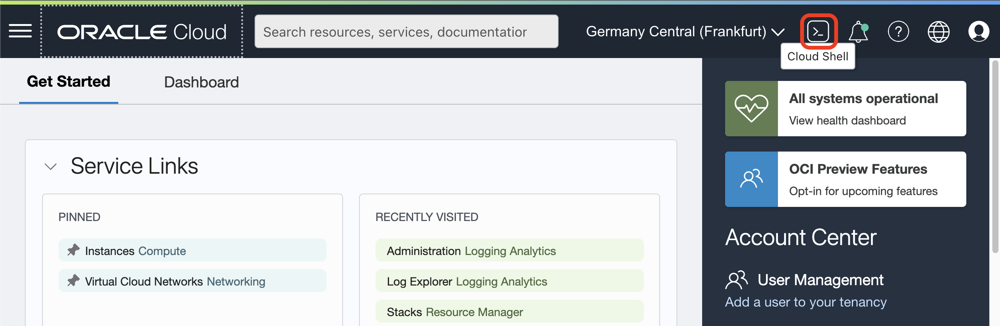

  - Clone this repository with:
    ```
    <copy>
    git clone https://github.com/vmleon/oci-hello-loganalytics.git
    </copy>
    ```

  - Change directory to oci-hello-loganalytics/provisioning:
    ```
    <copy>
    cd oci-hello-loganalytics/provisioning
    </copy>
    ```


  - Terraform initiate:

    ```
    <copy>
    terraform init
    </copy>
    ```

  - Before we apply the infrastructure with terraform, we need to set some variables.

  - Let's start with copy the template variable file:

    ```
    <copy>
    cp terraform.tfvars_template terraform.tfvars
    </copy>
    ```

  - Get the values and copy them aside from running these commands

    Region:
    ```
    <copy>
    echo $OCI_REGION
    </copy>
    ```
    Tenancy:
    ```
    <copy>
    echo $OCI_TENANCY
    </copy>
    ```

  If using the root compartment (trials) for compartment_ocid set the OCI_TENANCY value as well, otherwise, use the specific OCID compartment:

  Do you want to search for a specific compartment by name? Use the following command and replace <COMPARTMENT_NAME> by the name of the compartment.

    ```
    <copy>
    oci iam compartment list \
      --all \
      --compartment-id-in-subtree true \
      --query 'data[0].id' \
      --name <COMPARTMENT_NAME>
    </copy>
    ```
 - Edit the file with vim:

    NOTE: You can leave empty the profile property

    ```
    <copy>
      vim terraform.tfvars
    </copy> 
    ```

 - An example of the final result would be:
  
    ```
    <copy>
      region = "eu-frankfurt-1"
      tenancy_ocid = "ocid1.tenancy.oc1..aaa............."
      compartment_ocid = "ocid1.compartment.oc1..aaa.............""
      profile = ""
    </copy>
    ```
 - Run the Terraform apply:
    ```
    <copy>
      terraform apply -auto-approve
    </copy>
    ```
- After 10 to 20 minutes the resources should be created.

 You will see something like this:

    ```
    <copy>
      Apply complete! Resources: 19 added, 0 changed, 0 destroyed.

      Outputs:

      deployed_oke_kubernetes_version = "v1.22.5"
      generated_private_key_pem = <sensitive>
      kubeconfig_for_kubectl = "export KUBECONFIG=$(pwd)/generated/kubeconfig"
    </copy>
    ```

- Run that last command:

    ```
    <copy>
    export KUBECONFIG=$(pwd)/generated/kubeconfig
    </copy>
    ```


## Task 4: Application Testing

  - With the **_KUBECONFIG_** exported you can use **_kubectl_** to get some information

   Kubernetes Nodes:
    ```
    <copy>
      kubectl get nodes
    </copy>
    ```
  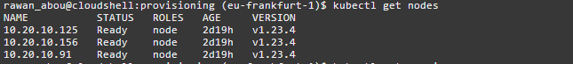
    Kubernetes services:

    ```
    <copy>
      kubectl get services
    </copy>
    ```  
  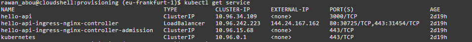
    You can also list the helm app installed with:
    ```
    <copy>
      helm list
    </copy>
    ```
  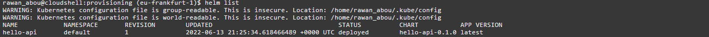
  Make sure the application hello-api is successfully deployed.

  - Get the public IP of the load balancer into the variable **`LB_PUBLIC_IP`**:
    ```
    <copy>
      export LB_PUBLIC_IP=$(kubectl get services -o jsonpath='{.items[?(@.spec.type=="LoadBalancer")].status.loadBalancer.ingress[0].ip}')
    </copy>
    ```
  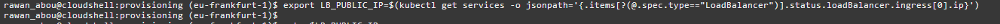
  - Print the IP, it should return a valid public IP address.
    ```
    <copy>
      echo $LB_PUBLIC_IP
    </copy>
    ```
  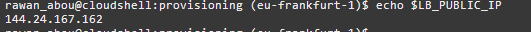
  - You are going to generate some workload and therefore logs to be explored with Logging Analytics. We are using a tool called k6.oi run in a container locally.
    ```
    <copy>
      docker run -i grafana/k6 run -e LB_PUBLIC_IP=$LB_PUBLIC_IP - <../load/test.js
    </copy>
    ```
    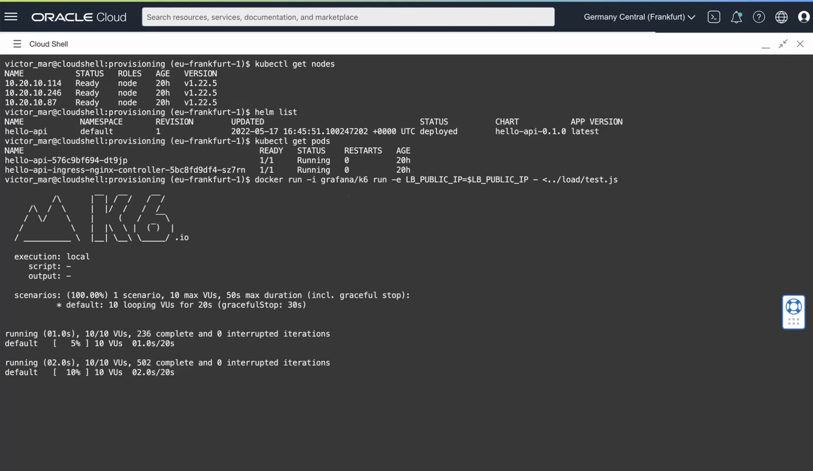

  Finally, generate an error with this curl command on an endpoint that doesn't exist, you can run it for several times to create several logs.

    ```
    <copy>
    curl -s http://$LB_PUBLIC_IP/nofound
    </copy>
    ```
    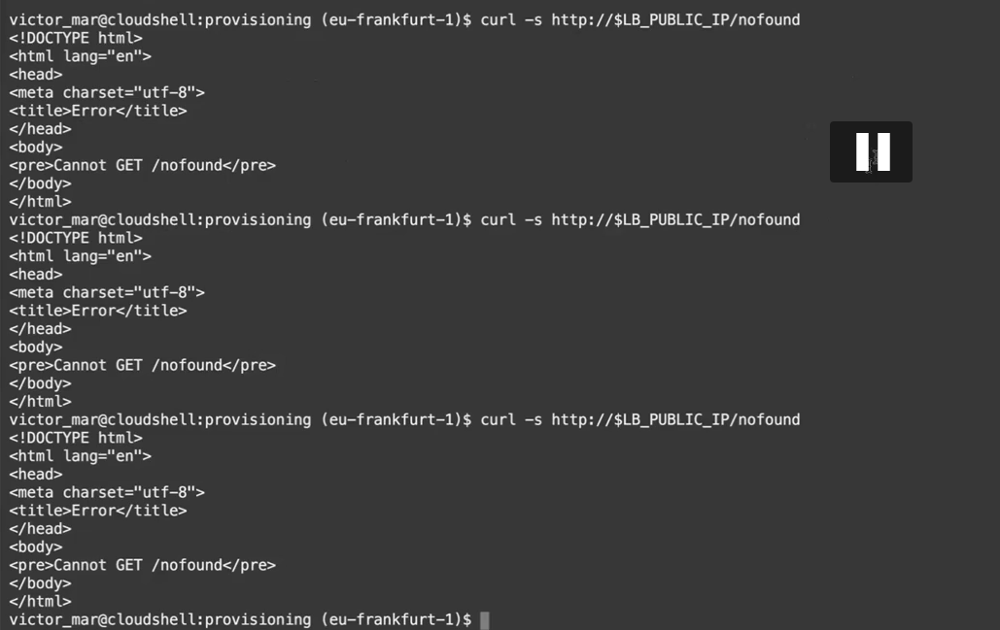
  Well done, you can now proceed to the next lab!

## Acknowledgements
  - **Author** - Rawan Aboukoura - Technology Product Strategy Manager, Vittorio Cioe - MySQL Solution Engineer
  - **Contributors** - Priscila Iruela - Technology Product Strategy Director, Victor Martin - Technology Product Strategy Manager 
  - **Last Updated By/Date** - Anoosha Pilli, September 2021
