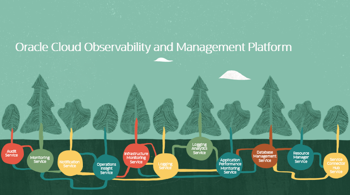

# Introduction

## About this Workshop

This provides an end-to-end monitoring solution for Oracle Container Engine for Kubernetes (OKE) and other forms of Kubernetes Clusters using Logging Analytics, Monitoring and other Oracle Cloud Infrastructure (OCI) Services.
This solutions offers collection of various logs of a Kubernetes cluster into OCI Logging Analytics and offer rich analytics on top of the collected logs. Users may choose to customise the log collection by modifying the out of the box configuration that it provides.
OKE or Kubernetes comes up with some built-in services where each one has different responsibilities and they run on one or more nodes in the cluster either as Deployments or DaemonSets.

"Kubernetes objects are persistent entities in the Kubernetes system. Kubernetes uses these entities to represent the state of your cluster. Specifically, they can describe:

- What containerized applications are running (and on which nodes)
- The resources available to those applications
- The policies around how those applications behave, such as restart policies, upgrades, and fault-tolerance"

Estimated Workshop Time: X minutes

### Objectives

In this workshop, you will learn how to:

### Prerequisites

-  This workshop requires an Oracle Cloud account with available credits, you may check out this **[video](https://www.youtube.com/watch?v=4U-0SumNz6w)** to help you signing up. You also can use a paid cloud account or a trial cloud account as well.
  
[Trial SignUp](youtube:4U-0SumNz6w)

- Enable Logging analytics sevice, first go to the menu and select **Observability and Management** and select **Logging Analytics**

- Then click  **Start Using Logging Analytics**

- Once done, click **Take Me To Log Explorer**

Ready? let's start learning!

## Acknowledgements
- **Author** -  
- **Contributors** 
- **Last Updated By/Date** 
