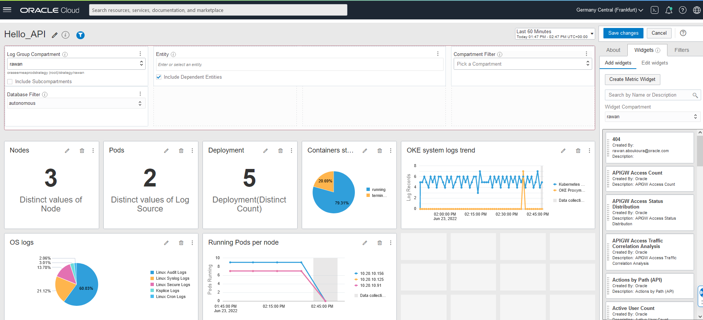

# Logging Analytics

## Introduction

In this lab we will unleash the capabilites of Logging Analytics and review aggregated data in a dashboard and explore the available logs in the Log Explorer. 

Estimated Time: X minutes

### Objectives

In this lab, you will:
-	explore the Log Explorer and diffrent visualization capabilites.
- create dashboard.


### Prerequisites

- complete lab 1.
  

## Task 1: Review the collected logs in the Log Explorer 

  - Go to **_Menu > Observability & Management > Logging Analytics > Log Explorer**

  

  - On the filter menu on the left, click on **_Log source_** and select **_hello-api-source_**.
  
  

  - As you can see in the query field it shows the **'Log Source' = 'hello-api-source'** but the pie visualisation doesn't show a meaningful data so we can change it by choosing different visualisation.
  
  

  - Select **Line** as visualization, and to see the workload over a longer period of time you can change the duration selected from the top right side.

  
  
  

  - You can save the current Log Source visualisation in a saparated dashboard by clicking **Action** > **Save as**
  

  - Select the right compartment, choose a name for the **Search Name** and click **Add to dashboard** and choose **new dashboard**, select the same compartment as the Search Name and enter a name for the dashborad in the **Dashboard Name** 
  

## Task 2: Search for the error logs 
 
  - Select **Records and Histograms** as visualization.
  

  - At the query field on the top, paste the following query to filter the logs with **404** error and click **Run**:

    ```
    <copy>
    '404' and 'Log Source' = 'hello-api-source' | timestats count as logrecords by 'Log Source' | sort -logrecords
    </copy>
    ```
  - You will see the log errors 404 you generated with the /notfound path.
  

  - To track the error occuration we will add it to the dashboard created earlier in task 1
  

  - Select the same compartment and change the **Search Name**, select **Add to dashboard** > **Existing Dashboard** and choose the dashboard you created in task 1.
  
  -  To view the created dashboard, from the top left side go to **Dashboards**, and select the created dashboard **Hello_API**
  
  

  - Here you can see the saved searches 
  

  - To design your costumized dashboard as you prefer by clicking on the **Actions** > **Edit**
  
  

  -  You can simply drag and drop the widgets to change their locations as following
  
  
  Well done, you can now proceed to the next lab!

## Acknowledgements
  - **Author** - Rawan Aboukoura - Technology Product Strategy Manager, Vittorio Cioe - MySQL Solution Engineer
  - **Contributors** - Priscila Iruela - Technology Product Strategy Director, Victor Martin - Technology Product Strategy Manager 
  - **Last Updated By/Date** - Anoosha Pilli, September 2021
