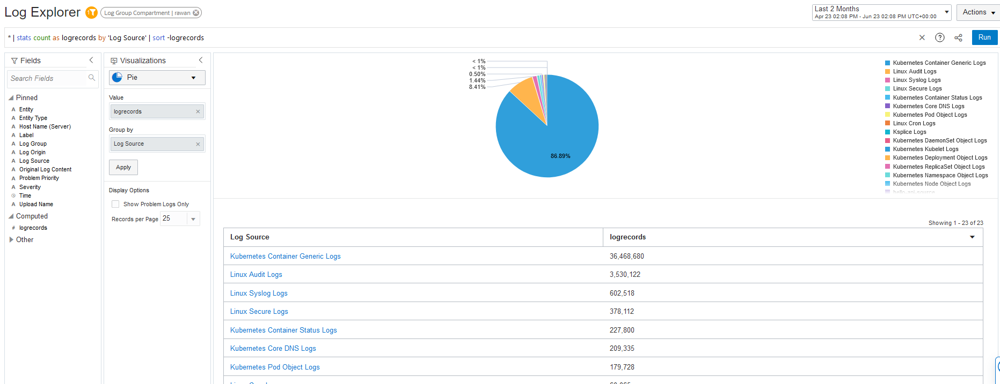
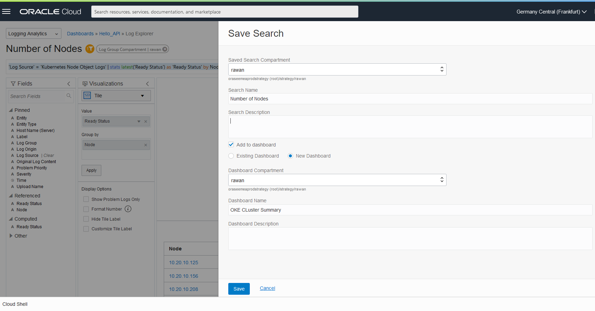
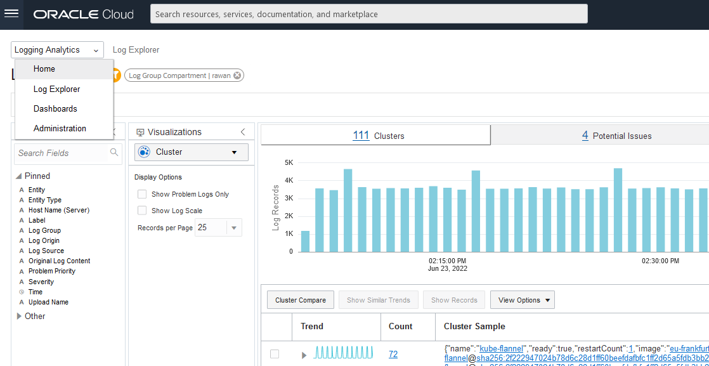
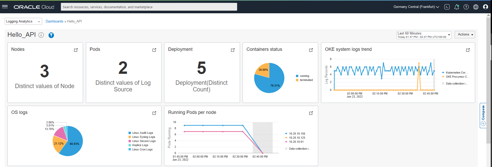

# Logging Analytics

## Introduction

In this lab we will unleash the capabilites of Logging Analytics and review aggregated data in a dashboard and explore the available logs in the Log Explorer. 

Estimated Time: X minutes

### Objectives

In this lab, you will:
-	explore the Log Explorer and diffrent visualization capabilites.
- create dashboard.


### Prerequisites

- complete lab 1.
  

## Task 1: Review the collected logs in the Log Explorer 

  - Let's start discover some of the Logging Analytics capabilities, go to **_Menu > Observability & Management > Logging Analytics > Log Explorer**

  

  - You will see that logs has already started to show on the graph, let's try diffrent visualiztions to understand the situation of our enviroment, 
    
    > Make sure you have chose the right comaprtamnet 
   

   - Choose the **Cluster** Visualization, which apply the machine learning capabilities to identify the log records into(clusters, potential issues, outliers,trends)

  

## Task 2: Analyse The Application Logs

  - To have a deeper view of our application you can filter **Log Source** and choose the one we created in the previous lab **hello-api-source**, where we can find info about the running application
  
  

  - As you can see in the query field it shows the **'Log Source' = 'hello-api-source'** but the pie visualisation doesn't show a meaningful data so we can change it by choosing different visualisation.
  
  

  - Select **Line** as visualization, and to visualize the workload over a longer period of time you can change the duration selected from the top right side.

  
  
  

 
  - Select **Records and Histograms** as visualization.
  

  - At the query field on the top, paste the following query to filter the logs with **404** error and click **Run**:

    ```
    <copy>
    '404' and 'Log Source' = 'hello-api-source' | timestats count as logrecords by 'Log Source' | sort -logrecords
    </copy>
    ```
  - You will see the log errors 404 you generated with the /notfound path.
  


## Task 3: Create Your Own Dashboard

 - To keep an eye on the enviroment we will save some searches that show a summary view of the OKE logs and matrices to a new dashboard that will constantly update the views regarding those specific searches you choose, for this workshop I have chosen to save the following searches:
### Number of Nodes:
  - At the query box paste the following:
  ```
  <copy>'Log Source' = 'Kubernetes Node Object Logs' | stats latest('Ready Status') as 'Ready Status' by Node
  </copy>
  ```
  And choose Visualization **Tile**
  
  
 - to create a new dashboard go to the top right side and click  **Action** > **Save as**
  

  - Select the right compartment, choose a name for the **Search Name** and click **Add to dashboard** and choose **new dashboard**, select the same compartment as the Search Name and enter a name for the dashborad in the **Dashboard Name** 
  

### Container Status
  - At the query box paste the following:

```
<copy>
</copy>
```
And choose Visualization
![]
  - Click the **Actions** drill down and select the same compartment and change the **Search Name**, select **Add to dashboard** > **Existing Dashboard** and choose the dashboard you created earlier.
![]
 
### Container Status
  - At the query box paste the following:

```
<copy>
</copy>
```
And choose Visualization
![]
  - Click the **Actions** drill down and select the same compartment and change the **Search Name**, select **Add to dashboard** > **Existing Dashboard** and choose the dashboard you created earlier.
![] 

### Container Status
  - At the query box paste the following:

```
<copy>
</copy>
```
And choose Visualization
![]
  - Click the **Actions** drill down and select the same compartment and change the **Search Name**, select **Add to dashboard** > **Existing Dashboard** and choose the dashboard you created earlier.
![]

### Container Status
  - At the query box paste the following:

```
<copy>
</copy>
```
And choose Visualization
![]
  - Click the **Actions** drill down and select the same compartment and change the **Search Name**, select **Add to dashboard** > **Existing Dashboard** and choose the dashboard you created earlier.
![]

### Container Status
  - At the query box paste the following:

```
<copy>
</copy>
```
And choose Visualization
![]
  - Click the **Actions** drill down and select the same compartment and change the **Search Name**, select **Add to dashboard** > **Existing Dashboard** and choose the dashboard you created earlier.
![]

### Container Status
  - At the query box paste the following:

```
<copy>
</copy>
```
And choose Visualization
![]
  - Click the **Actions** drill down and select the same compartment and change the **Search Name**, select **Add to dashboard** > **Existing Dashboard** and choose the dashboard you created earlier.
![]
  -  To view the created dashboard, from the top left side go to **Dashboards**, and select the created dashboard **Hello_API**
  
  

  - Here you can see the saved searches 
  

  - To design your costumized dashboard as you prefer by clicking on the **Actions** > **Edit**
  
  

  -  You can simply drag and drop the widgets to change their locations as following
  
  
  Well done, you can now proceed to the next lab!

## Acknowledgements
  - **Author** - Rawan Aboukoura - Technology Product Strategy Manager, Victor Martin - Technology Product Strategy Manager 
  - **Contributors** -
  - **Last Updated By/Date** - Anoosha Pilli, September 2021
