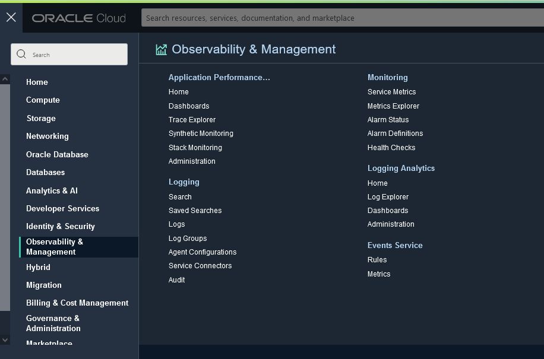
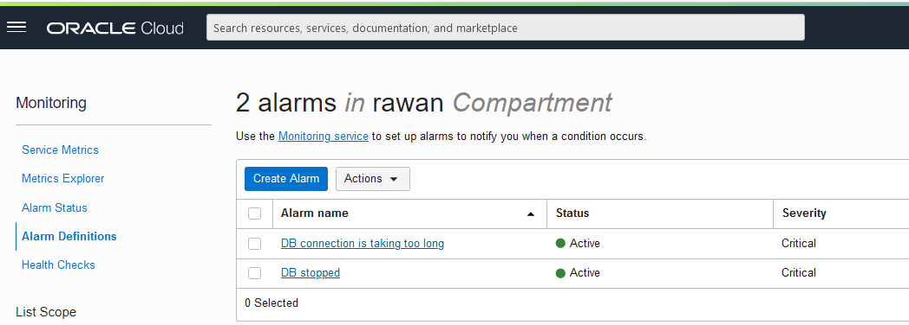
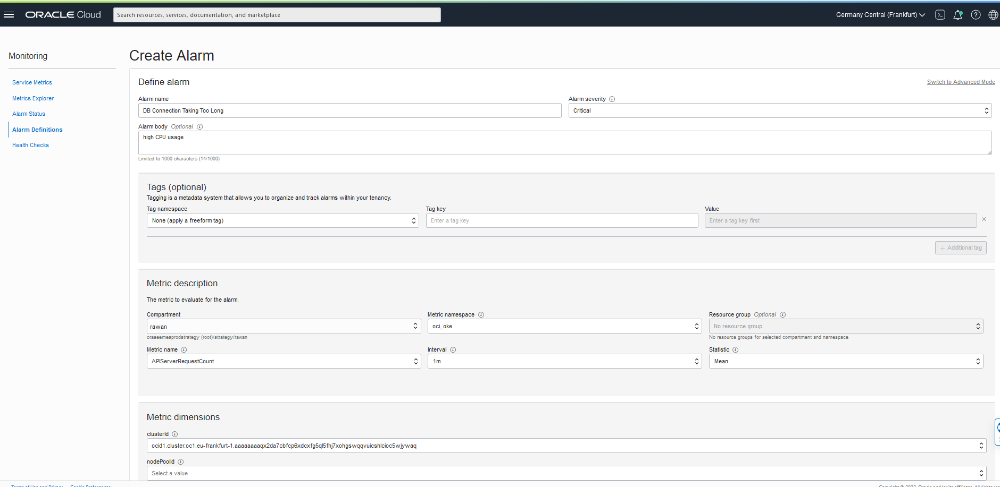
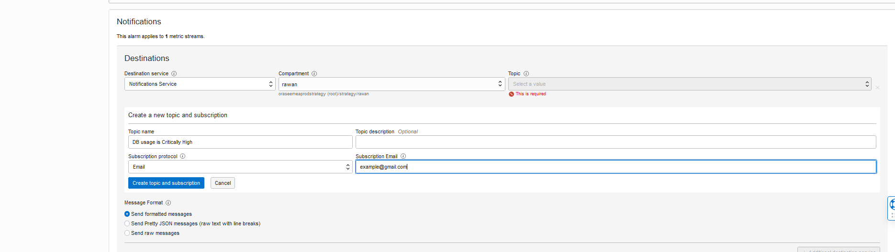

# Monitoring

## Introduction

In this lab we will unleash the capabilites of  and review aggregated data in a dashboard and explore the available logs in the Log Explorer. 

Estimated Time: X minutes

### Objectives

In this lab, you will:
- create alarm

## Task 2: Create An Alarm 

- Fom the main menu, click **Alarm Definitions**, then click **Create Alarm**
  
  

- Fill in the required information 
 

- enter an email to recieve a notification on 
  
  
- finally, click create alarm
